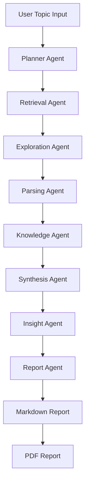
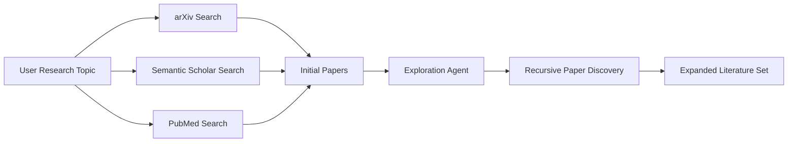
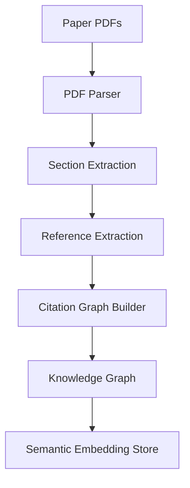
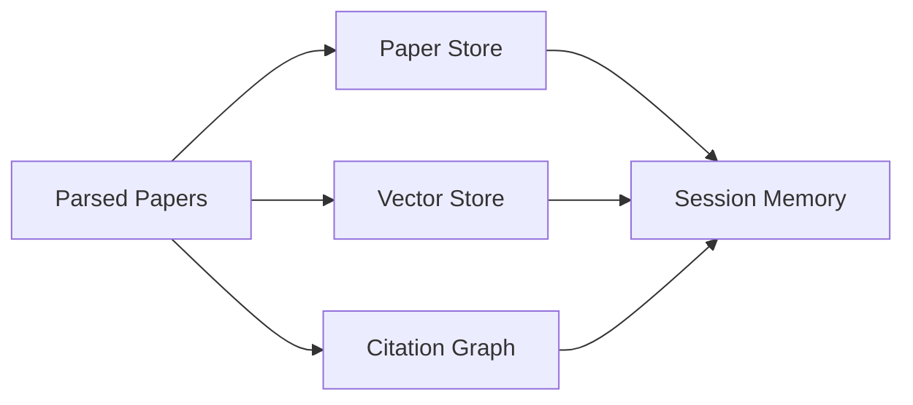
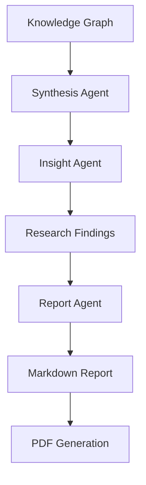
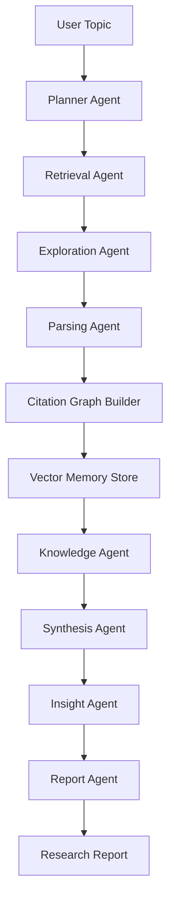

# AI Research Platform

An **autonomous multi-agent AI system for scientific literature discovery, analysis, and report generation**.

This platform performs **end-to-end research automation**: discovering papers, expanding literature networks, constructing citation graphs, synthesizing insights, and generating structured research reports.

The system is designed to operate on **any research topic at runtime** and mimics the workflow of a human researcher.

---

# Overview

Modern research requires navigating thousands of scientific papers across multiple databases. This platform automates the research workflow using a **modular multi-agent architecture**.

Key capabilities:

* Autonomous literature discovery
* Recursive research exploration
* Citation graph construction
* Semantic memory via vector embeddings
* Research synthesis and insight generation
* Markdown and PDF report generation
* Experiment pipeline support for data-science topics

The platform integrates with major research repositories including:

* arXiv
* Semantic Scholar
* PubMed

---

# System Architecture

The platform uses a **multi-agent research pipeline**.

```
User Topic
     ↓
Planner Agent
     ↓
Retrieval Agent
     ↓
Exploration Agent (recursive search)
     ↓
Parsing Agent
     ↓
Citation Graph Builder
     ↓
Vector Memory Store
     ↓
Knowledge Agent
     ↓
Synthesis Agent
     ↓
Insight Agent
     ↓
Report Agent
     ↓
Markdown + PDF Report
```

Each agent performs a specialized stage of the research workflow.

---

# Features

## Autonomous Literature Discovery

The system retrieves papers from multiple academic sources and automatically expands the literature space through recursive exploration.

## Recursive Research Exploration

A dedicated exploration agent iteratively searches related papers to uncover deeper literature connections.

## Citation Graph Construction

A directed graph of citations is built to identify:

* influential papers
* citation clusters
* foundational research

## Semantic Memory

Paper abstracts are embedded and stored in a vector database using:

* ChromaDB
* Sentence Transformers

This enables semantic retrieval across research topics.

## Research Synthesis

The system aggregates knowledge across multiple papers and generates structured insights.

## Automated Report Generation

Final outputs include:

* Markdown research report
* PDF research report

PDF generation uses:

* WeasyPrint

## Experiment Pipeline (Optional)

For data science research topics, the system supports:

* hypothesis generation
* experiment execution
* evaluation of results

---

# Project Structure

```
ai-research-platform/
│
├── main.py
├── requirements.txt
├── README.md
│
├── configs/
│   ├── settings.yaml
│   └── prompts.yaml
│
├── agents/
│   ├── planner_agent.py
│   ├── retrieval_agent.py
│   ├── exploration_agent.py
│   ├── parsing_agent.py
│   ├── knowledge_agent.py
│   ├── synthesis_agent.py
│   ├── insight_agent.py
│   ├── report_agent.py
│   └── experimental/
│       ├── experiment_agent.py
│       └── evaluation_agent.py
│
├── tools/
│   ├── arxiv_search.py
│   ├── semantic_scholar.py
│   ├── pubmed_search.py
│   ├── web_search.py
│   ├── pdf_parser.py
│   ├── pdf_report.py
│   ├── citation_graph.py
│   ├── graph_visualizer.py
│   └── config_loader.py
│
├── memory/
│   ├── session_memory.py
│   ├── paper_store.py
│   ├── vector_store.py
│   └── token_logger.py
│
├── pipelines/
│   ├── base_pipeline.py
│   ├── router.py
│   ├── literature_pipeline.py
│   └── datascience_pipeline.py
│
├── schemas/
│   ├── paper.py
│   ├── research_plan.py
│   ├── knowledge_node.py
│   └── report.py
│
├── cache/
├── reports/
└── data/
```

---
# Architecture

The AI Research Platform uses a **modular multi-agent architecture** where specialized agents collaborate to automate the scientific research process.

Each agent is responsible for a distinct stage in the research workflow, enabling scalable and extensible research pipelines.

---

# High-Level System Architecture



---

# Literature Discovery Workflow

This stage collects papers from academic repositories and recursively explores related work.



External research sources:

* arXiv
* Semantic Scholar
* PubMed

---

# Knowledge Processing Pipeline

The retrieved papers are processed to extract structured knowledge.



Technologies used:

* NetworkX for citation graphs
* Sentence Transformers for embeddings
* ChromaDB for vector storage

---

# Memory Architecture

The system uses **multiple memory layers** to retain research knowledge.



Memory components:

| Memory Type    | Purpose                       |
| -------------- | ----------------------------- |
| Session Memory | runtime state management      |
| Paper Store    | structured paper storage      |
| Vector Store   | semantic similarity search    |
| Citation Graph | research relationship mapping |

---

# Report Generation Pipeline

The final stage synthesizes insights and generates structured reports.



PDF reports are generated using:

* WeasyPrint

---

# Full Research Workflow



This workflow enables **end-to-end autonomous research generation**.

---

# Key Design Principles

**Modularity**

Each agent operates independently, allowing easy extension and experimentation.

**Scalability**

The architecture supports additional research sources, tools, and agents.

**Extensibility**

New pipelines (e.g., experiment pipelines, simulation pipelines) can be integrated with minimal changes.

**Autonomous Exploration**

Recursive literature discovery enables deeper research coverage beyond initial search results.

---
# Installation

Clone the repository.

```
git clone https://github.com/yourusername/ai-research-platform.git
cd ai-research-platform
```

Create a virtual environment.

```
python -m venv venv
source venv/bin/activate
```

Install dependencies.

```
pip install -r requirements.txt
```

---

# Configuration

Set API keys as environment variables if required.

```
export OPENAI_API_KEY=your_api_key
```

Adjust system settings in:

```
configs/settings.yaml
```

---

# Usage

Run the system with a research topic.

```
python main.py --topic "Graph Neural Networks for Drug Discovery"
```

Example topics:

```
python main.py --topic "AI agents for autonomous software development"

python main.py --topic "Self-supervised learning in medical imaging"

python main.py --topic "Large language models for scientific discovery"
```

Reports will be generated in:

```
reports/
```

Outputs include:

```
topic_name.md
topic_name.pdf
```

---

# Example Output

Generated report structure:

```
Title
Abstract
Introduction
Related Work
Methodologies
Key Findings
Research Gaps
Future Directions
References
```

---

# Technologies Used

Core components include:

* Python
* Multi-Agent Architecture
* Vector Databases
* Graph Analysis
* Academic Search APIs

Libraries used:

* ChromaDB
* NetworkX
* Sentence Transformers
* WeasyPrint

---

# Research Applications

This platform can support:

* literature review automation
* research trend discovery
* knowledge graph construction
* research gap identification
* rapid academic exploration

Potential users include:

* academic researchers
* graduate students
* R&D engineers
* data scientists

---

# Future Work

Planned improvements include:

* multi-agent debate for research validation
* automatic research gap detection
* paper ranking via citation centrality
* interactive visualization dashboards
* experiment orchestration pipelines

---

# Contributing

Contributions are welcome.

1. Fork the repository
2. Create a feature branch
3. Submit a pull request

---

# License

This project is released under the MIT License.

---

# Acknowledgements

The platform builds on ideas from modern AI research tools including:

* Connected Papers
* Elicit
* Perplexity AI

These systems inspired aspects of literature exploration and research automation.

---

# Author

Developed as an experimental **AI research automation system** exploring multi-agent architectures for scientific discovery.
