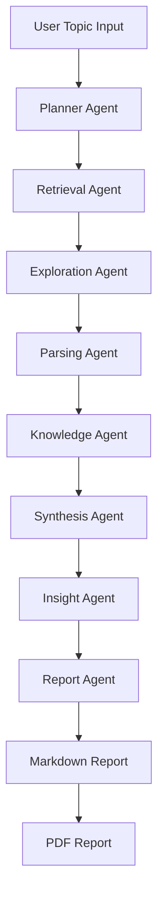
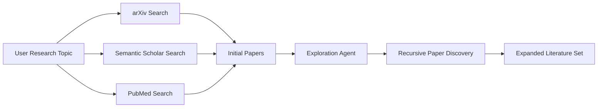
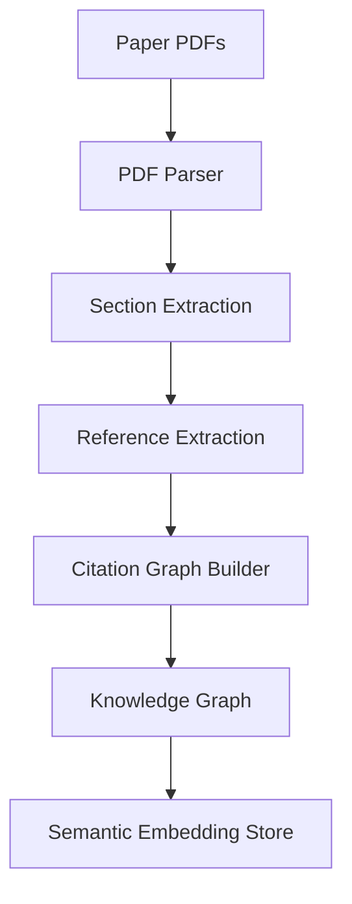
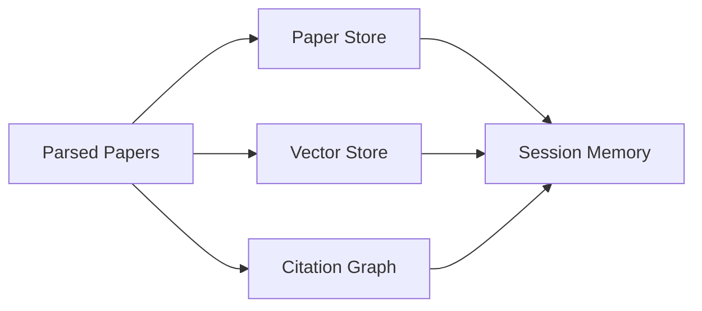
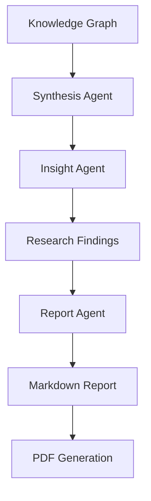
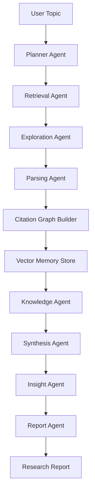

# AI Research Platform

An **autonomous multi-agent AI system for scientific literature discovery, analysis, and report generation with ML experimentation**.

This platform performs **end-to-end research automation**: discovering papers, expanding literature networks, constructing citation graphs, synthesizing insights, running ML experiments, and generating structured research reports.

The system is designed to operate on **any research topic at runtime** with both interactive and command-line interfaces, mimicking the workflow of a human researcher.

---

# Overview

Modern research requires navigating thousands of scientific papers across multiple databases. This platform automates the research workflow using a **modular multi-agent architecture** with real-time logging and error handling.

Key capabilities:

* **Autonomous literature discovery** from multiple sources
* **Recursive research exploration** with depth control
* **Citation graph construction** and analysis
* **Semantic memory** via vector embeddings
* **Research synthesis** and insight generation
* **Real ML experiments** with multiple model types
* **Markdown and PDF report generation**
* **Interactive and command-line interfaces**
* **Comprehensive logging** and error recovery
* **Generic platform** - works with any research topic

The platform integrates with major research repositories including:

* arXiv
* Semantic Scholar
* PubMed

---

# What's New ✨

## Recent Major Updates

### **Critical Fixes & Enhancements**
- **Fixed Router Architecture**: Resolved import issues and created proper Router class
- **Real ML Experiments**: Implemented actual model training (Random Forest, Neural Networks, Transformers)
- **Robust Error Handling**: Added comprehensive error recovery across all agents
- **Interactive Mode**: User-friendly input system for dynamic research topics
- **Enhanced Logging**: Real-time agent activity logs in terminal and files
- **Generic Platform**: No more hardcoded queries - works with any topic

### **New ML Experiment Capabilities**
- **Multiple Models**: Random Forest, Logistic Regression, Neural Networks, Attention-based Transformers
- **Real Datasets**: Iris, Wine, Synthetic classification datasets
- **Performance Metrics**: Accuracy, F1-score, model comparison
- **GPU Support**: Automatic CUDA detection and utilization

### **Improved User Experience**
- **Interactive Mode**: `python main.py --interactive`
- **Better Error Messages**: Clear feedback and fallback options
- **Progress Tracking**: Real-time pipeline progress updates
- **Flexible Input**: Support for any research topic at runtime

---

# System Architecture

The platform uses a **multi-agent research pipeline**.

```
User Topic
     ↓
Planner Agent
     ↓
Retrieval Agent
     ↓
Exploration Agent (recursive search)
     ↓
Parsing Agent
     ↓
Citation Graph Builder
     ↓
Vector Memory Store
     ↓
Knowledge Agent
     ↓
Synthesis Agent
     ↓
Insight Agent
     ↓
Report Agent
     ↓
Markdown + PDF Report
```

Each agent performs a specialized stage of the research workflow.

---

# Features

## Autonomous Literature Discovery

The system retrieves papers from multiple academic sources and automatically expands the literature space through recursive exploration.

## Recursive Research Exploration

A dedicated exploration agent iteratively searches related papers to uncover deeper literature connections.

## Citation Graph Construction

A directed graph of citations is built to identify:

* influential papers
* citation clusters
* foundational research

## Semantic Memory

Paper abstracts are embedded and stored in a vector database using:

* ChromaDB
* Sentence Transformers

This enables semantic retrieval across research topics.

## Research Synthesis

The system aggregates knowledge across multiple papers and generates structured insights.

## Automated Report Generation

Final outputs include:

* Markdown research report
* PDF research report

PDF generation uses:

* WeasyPrint

## Experiment Pipeline (Optional)

For data science research topics, the system supports:

* hypothesis generation
* experiment execution
* evaluation of results

---

# Project Structure

```
ai-research-platform/
│
├── main.py
├── requirements.txt
├── README.md
│
├── configs/
│   ├── settings.yaml
│   └── prompts.yaml
│
├── agents/
│   ├── planner_agent.py
│   ├── retrieval_agent.py
│   ├── exploration_agent.py
│   ├── parsing_agent.py
│   ├── knowledge_agent.py
│   ├── synthesis_agent.py
│   ├── insight_agent.py
│   ├── report_agent.py
│   └── experimental/
│       ├── experiment_agent.py
│       └── evaluation_agent.py
│
├── tools/
│   ├── arxiv_search.py
│   ├── semantic_scholar.py
│   ├── pubmed_search.py
│   ├── web_search.py
│   ├── pdf_parser.py
│   ├── pdf_report.py
│   ├── citation_graph.py
│   ├── graph_visualizer.py
│   └── config_loader.py
│
├── memory/
│   ├── session_memory.py
│   ├── paper_store.py
│   ├── vector_store.py
│   └── token_logger.py
│
├── pipelines/
│   ├── base_pipeline.py
│   ├── router.py
│   ├── literature_pipeline.py
│   └── datascience_pipeline.py
│
├── schemas/
│   ├── paper.py
│   ├── research_plan.py
│   ├── knowledge_node.py
│   └── report.py
│
├── cache/
├── reports/
└── data/
```

---
# Architecture

The AI Research Platform uses a **modular multi-agent architecture** where specialized agents collaborate to automate the scientific research process.

Each agent is responsible for a distinct stage in the research workflow, enabling scalable and extensible research pipelines.

---

# High-Level System Architecture



---

# Literature Discovery Workflow

This stage collects papers from academic repositories and recursively explores related work.



External research sources:

* arXiv
* Semantic Scholar
* PubMed

---

# Knowledge Processing Pipeline

The retrieved papers are processed to extract structured knowledge.



Technologies used:

* NetworkX for citation graphs
* Sentence Transformers for embeddings
* ChromaDB for vector storage

---

# Memory Architecture

The system uses **multiple memory layers** to retain research knowledge.



Memory components:

| Memory Type    | Purpose                       |
| -------------- | ----------------------------- |
| Session Memory | runtime state management      |
| Paper Store    | structured paper storage      |
| Vector Store   | semantic similarity search    |
| Citation Graph | research relationship mapping |

---

# Report Generation Pipeline

The final stage synthesizes insights and generates structured reports.



PDF reports are generated using:

* WeasyPrint

---

# Full Research Workflow



This workflow enables **end-to-end autonomous research generation**.

---

# Key Design Principles

**Modularity**

Each agent operates independently, allowing easy extension and experimentation.

**Scalability**

The architecture supports additional research sources, tools, and agents.

**Extensibility**

New pipelines (e.g., experiment pipelines, simulation pipelines) can be integrated with minimal changes.

**Autonomous Exploration**

Recursive literature discovery enables deeper research coverage beyond initial search results.

---
# Installation

Clone the repository.

```
git clone https://github.com/yourusername/ai-research-platform.git
cd ai-research-platform
```

Create a virtual environment.

```
python -m venv venv
source venv/bin/activate
```

Install dependencies.

```
pip install -r requirements.txt
```

---

# Configuration

Set API keys as environment variables if required.

```
export OPENAI_API_KEY=your_api_key
```

Adjust system settings in:

```
configs/settings.yaml
```

---

# Usage

## Interactive Mode (Recommended)

Start the platform in interactive mode for dynamic research topics:

```bash
python main.py --interactive
```

This will launch a user-friendly interface where you can:
- Enter any research topic
- Choose between literature or datascience modes
- See real-time progress and agent logs
- Get immediate feedback and results

## Command Line Mode

Run the system directly with command line arguments:

```bash
# Basic literature review
python main.py --topic "Graph Neural Networks for Drug Discovery"

# Literature review + ML experiments
python main.py --topic "AI agents for autonomous software development" --mode datascience

# Show help
python main.py --help
```

## Available Modes

- **literature**: Literature review, synthesis, and report generation
- **datascience**: Literature review + ML experiments with real model training

## Example Topics

```bash
# Computer Science
python main.py --topic "Transformer architectures for NLP" --mode datascience
python main.py --topic "Graph neural networks for drug discovery"

# Medical Research
python main.py --topic "Self-supervised learning in medical imaging"
python main.py --topic "AI applications in genomics"

# General Research
python main.py --topic "Climate change modeling with machine learning"
python main.py --topic "Quantum computing applications"
```

## Output

Reports will be generated in:

```
reports/
├── topic_name_20240310_1430.md    # Markdown report
└── topic_name_20240310_1430.pdf   # PDF report
```

Outputs include:

```
topic_name.md
topic_name.pdf
```

---

# Logging

All agent activities are logged to:
- **Terminal**: Real-time progress updates with timestamps
- **File**: `research_platform.log` for detailed analysis

Example log output:
```
2024-03-10 14:30:15 - __main__ - INFO - Starting research on topic: "Graph Neural Networks"
2024-03-10 14:30:16 - retrieval_agent - INFO - Retrieving papers for queries: ['Graph Neural Networks']
2024-03-10 14:30:18 - exploration_agent - INFO - Starting exploration with 10 seed papers
2024-03-10 14:30:25 - experiment_agent - INFO - Running experiments for models: ['random_forest', 'neural_network']
```

---

# Example Output

Generated report structure:

```
# Research Report

**Topic:** [Your Research Topic]

## Summary
[Comprehensive synthesis of findings]

## Key Findings
- [Key insight 1]
- [Key insight 2]

## Research Gaps
- [Identified gap 1]
- [Identified gap 2]

## Future Directions
- [Recommendation 1]
- [Recommendation 2]

## Sources
- [Paper 1 with link]
- [Paper 2 with link]
```

For datascience mode, additional sections include:
- **ML Experiments Performed**
- **Model Performance Comparison**
- **Best Performing Model**

---

# Technologies Used

Core components include:

* Python
* Multi-Agent Architecture
* Vector Databases
* Graph Analysis
* Academic Search APIs
* Machine Learning Frameworks
* Interactive CLI Interface

Libraries used:

* **Core**: ChromaDB, NetworkX, Sentence Transformers, WeasyPrint
* **ML/ML**: PyTorch, Scikit-learn, Transformers, Pandas, NumPy
* **Search**: arXiv, Semantic Scholar, PubMed APIs
* **UI**: Rich terminal output, Interactive prompts
* **Processing**: RapidFuzz, PyMuPDF, Markdown2

---

# Research Applications

This platform can support:

* **Literature Review Automation** - Comprehensive paper discovery and synthesis
* **ML Experiment Validation** - Test models and methodologies from papers
* **Research Trend Discovery** - Identify emerging patterns and directions
* **Knowledge Graph Construction** - Build citation and semantic networks
* **Research Gap Identification** - Find unexplored areas and opportunities
* **Rapid Academic Exploration** - Quick analysis of new research domains
* **Comparative Model Analysis** - Benchmark different ML approaches
* **Real-time Research Monitoring** - Track agent activities and progress

Potential users include:

* **Academic Researchers** - Literature reviews and gap analysis
* **Graduate Students** - Thesis research and topic exploration
* **R&D Engineers** - Technology scouting and validation
* **Data Scientists** - Model benchmarking and experimentation
* **Research Labs** - Automated literature monitoring
* **Industry Analysts** - Technology trend analysis

---

# Future Work

Planned improvements include:

* multi-agent debate for research validation
* automatic research gap detection
* paper ranking via citation centrality
* interactive visualization dashboards
* experiment orchestration pipelines

---

# Contributing

Contributions are welcome.

1. Fork the repository
2. Create a feature branch
3. Submit a pull request

---

# License

This project is released under the MIT License.

---

# Acknowledgements

The platform builds on ideas from modern AI research tools including:

* Connected Papers
* Elicit
* Perplexity AI

These systems inspired aspects of literature exploration and research automation.

---

# Author

Developed as an experimental **AI research automation system** exploring multi-agent architectures for scientific discovery.
